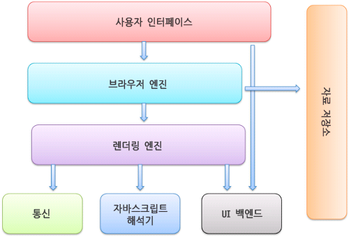

# 브라우저 동작 방법

브라우저 창에 naver.com 을 입력 했을 때, 어떤 과정을 거쳐 네이버 페이지가 화면에 보이는지 알아보자.

### 브라우저 

우리가 잘 사용하는 인터넷 익스플로러, 파이어폭스, 사파리, 크롬 등의 소프트웨어를 말한다. 

### 브라우저의 주요 기능 

브라우저의 주요 기능은 사용자가 선택한 자원을 서버에 요청하고 브라우저에 표시해주는 것이다. 
자원은 보통 HTML 문서지만, PDF나 이미지 혹은 다른 형태일 수 있다. 

브라우저는 HTML과 CSS 명세에 따라 HTML 파일을 해석해서 표시하는데, 이 명세는 웹 표준화 기구인 W3C(World Wide Web Consortium)에서 정한다. 
과거에는 브라우저들이 일부만 이 명세에 따라 구현하고 독자적인 방법으로 확장함으로써 웹 제작자가 심각한 호환성을 겪었지만 최근에는 대부분의 브라우저가 표준 명세를 따른다고 한다.

브라우저의 사용자 인터페이스는 서로 닮아있는데, 다음과 같은 요소들이 일반적이다. 
- url을 입력할 수 있는 주소 표시 줄
- 이전 버튼 & 다음 버튼
- 새로고짐 버튼 정지버튼
- 홈 버튼

### 브라우저의 주요 기능

#### 사용자 인터페이스
위 주소 표시줄, 이전/다음버튼, 북마크 등 사용자가 활용하는 서비스들(요청한 페이지를 보여주는 창을 제외한 나머지 부분)

#### 브라우저 엔진
사용자 인터페이스와 엔진 사이의 동작 제어 

#### 렌더링 엔진 
요청한 콘텐츠 표시(html 요청이 들어오면 -> html,css 파싱해서 화면에 표시)

#### 통신 
http 요청과 같은 네트워크 호출에 사용. 플렛폼 독립적인 인터페이스이고 각 플랫폼 하부에서 실행됨.

#### UI 백엔드
플렛폼에서 명시하지 않은 일반적 인터페이스. 콤보 박스창같은 기본적 장치를 그려줌

#### 자바스크립트 해석기
자바스크립트 코드를 해석하고 실행

#### 자료 저장소
쿠키 등 모든 종류의 자원을 하드 디스크에 저장하는 계층 

###  렌더링이란?

렌더링 엔진은 요청받은 내용을 브라우저 화면에 표시해준다. 
기본적으로 html, xml 문서와 이미지를 표시할 수 있다. 
추가로 확장이 필요한 유형은 바로 뜨지 않고 팝업으로 확장 여부를 묻는것을 볼 수 있다.)

#### 렌더링 엔진 종류 
크롬, 사파리 : 웹킷(Webkit)엔진 사용
파이어폭스 : 게코(Gecko) 엔진 사용

웹킷(Webkit) : 최초 리눅스 플랫폼에 동작하기 위한 오픈소스 엔진(애플이 맥과 윈도우에서 사파리 브라우저를 지원하기위해 수정을 더했음)

### 렌더링 동작 과정

1. 먼저 html 문서를 파싱한다. 
2. 콘텐츠 트리 내부에서 태그를 모두 DOM 노드로 변환한다. 
3. 그 다음 외부 css 파일과 함께 포함된 스타일 요소를 파싱한다. 
4. 이 스타일 정보와 html 표시 규칙은 렌더 트리라고 부르는 또 다른 트리를 생성한다.
5. 이렇게 생성된 렌더 트리는 정해진 순서대로 화면에 표시되는데, 생성 과정이 끝났을 때 배치가 진행되면서 노드가 화면의 정확한 위치에 표시되는 것을 의미한다. 
6. 이후에 UI 백엔드에서 렌더 트리의 각 노드를 가로지으며 형상을 만드는 그리기 과정이 진행된다. 
7. 이러한 과정이 점진적으로 진행되며, 렌더링 엔진은 좀 더 빠르게 사용자에게 제공하기 위해 모든 html을 파싱할 때까지 기다리지 않고 배치와 그리기 과정을 시작한다. 
8. 전송을 받고 기다리는 동시에 받은 내용을 먼저 화면에 보여준다.(웹 페이지에 접속할 때 한꺼번에 뜨지 않고 점점 화면에 나오는 것이 이 때문)

### DOM이란? 
Document Object Model(문서 객체 모델)

웹 페이지 소스를 까보면 <html>,<body> 와 같은 태그들이 존재한다.
이를 JavaScript가 활용할 수 있는 객체로 만들면 `문서객체`가 된다.
모델은 말 그대로, 모듈화로 만들었다거나, 객체를 인식한다라고 해석하면 된다. 
즉, DOM은 웹 브라우저가 html 페이지를 인식하는 방식을 말한다.
